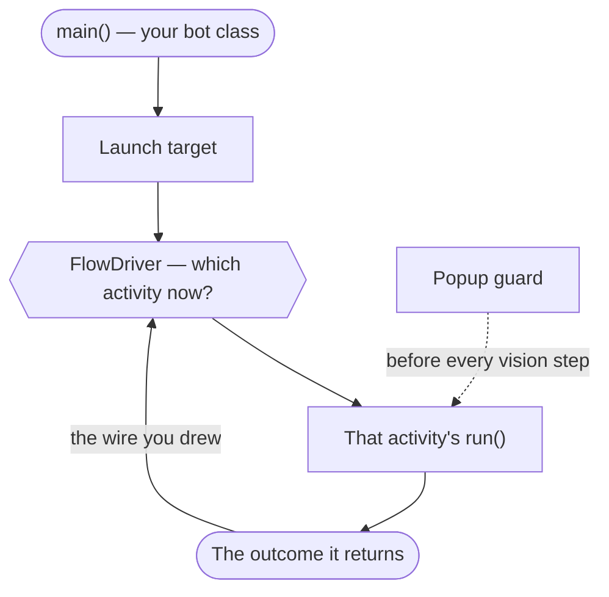

# The BotMaker workflow

<!-- Generated from com.botmaker.studio.docs.Workflow — edit that class, not this file.
     Regenerate: mvn -q exec:java -Dexec.mainClass=com.botmaker.studio.docs.WorkflowMarkdown -->

A BotMaker bot watches a game or app on your screen, decides what it sees, and clicks. You build it out of visual blocks in Studio, and Studio writes the Java for you — a real Maven project you could open in any IDE. The steps below are the order things are normally done in; only the first three are mandatory before a bot can do anything useful.

## How a bot runs

Your activities are not a script that runs top to bottom. The generated FlowDriver holds one current activity, runs it, and asks the flow graph what follows the outcome it reported — so the shape of a run is a loop, and it is the graph you drew that decides where it goes next.

- **main() — your bot class** — Installs the popup guard and hands control to Bot.start, which supervises the whole run and restarts the game through GoHome if it crashes or gets stuck.

- **Launch target** — The game or app you declared is started if it isn't already running. Nothing is captured or clicked until it is up.

- **FlowDriver — which activity now?** — The current node of the flow graph. This is the only place that decides what runs next; an activity never calls another activity.

- **That activity's run()** — The blocks you authored: capture, match, click, wait. A disabled activity is stepped over here, following the wire it would have taken.

- **The outcome it returns** — One of the activity's own named outcomes — the label on the wire leaving it in the flow editor.

- **Popup guard** (before every vision step) — Popups.run() is called before every vision step, whichever activity is running — so a daily reward covering the button is dismissed by one file instead of by every activity that might trip over it.

The driver follows the wire leaving that outcome and runs whatever is on the other end — for as long as there is one. A run ends when the outcome it reported has no wire leaving it: an unwired outcome is the stop, and there is no terminal node to draw.

## 1. Create a project

> A project is a normal Maven project under ~/BotMakerProjects/.

Studio generates the sources, the pom.xml and the scaffolding a bot needs — an entry point, an activity registry, a popup guard. You never have to edit those by hand; they are marked read-only in the editor precisely because Studio maintains them.

Project Setup is also where you come back to later: it is a checklist of what the project still needs — something to launch, something to capture, a reference resolution and the pictures it looks for — and it says where to set each one.

*In Studio:* 📋 Project Setup on the toolbar (contributed by the BotMaker SDK)

## 2. Tell the bot what to launch — the launch target

> What gets started before the bot runs: a Steam, Epic, Heroic or Faugus game, an executable, a command line, or an app inside an emulator.

This comes before the capture target for a practical reason: you cannot pick the window the bot watches until the game is on screen. Launch it from here first, then choose what to capture.

Studio scans your installed libraries so you pick a game from a list instead of typing an app id. Choosing an emulator app can also point the capture target at that emulator in the same move — a tickbox in the dialog, since it is a convenience and not a rule.

The launch target is yours and is stripped when you publish. What does travel is what you declare in the Publish dialog: the kinds of launch target your bot is known to work with. That is advice for whoever installs it — they still get to try anything on their machine — so declare what you actually tested, not what you hope works.

*In Studio:* 🚀 on the toolbar — it shows the current target

## 3. Tell the bot what to watch — the capture target

> Where the bot looks: a monitor, a window, the whole desktop, or an Android emulator.

Everything visual is relative to this one choice. Image search, OCR, colour sampling and every click coordinate are expressed inside the capture target, so a bot written against a game window keeps working when that window moves.

Like the launch target, this belongs to the machine that runs the bot, not to the bot. It is not published: when you install someone else's bot you pick your own.

*In Studio:* 🎯 Capture Targets on the toolbar (contributed by the BotMaker SDK)

## 4. Capture image templates

> Little pictures of buttons, icons and text that the bot matches against the screen.

An overlay opens over your game so you can draw a rectangle or an ellipse, or cut an object out with a transparent background so the match ignores whatever is behind it. "Capture many" takes a batch in one pass and names them together.

Templates are organised by tag, not by folder — a template used by two activities carries both tags instead of being copied. Tags render as folders in the pickers and in the Resource Manager, where you can also rename, re-tag or delete a template, and export a set as a .bmtemplates file to import into another project.

*In Studio:* ✂ Capture Templates on the toolbar (contributed by the BotMaker SDK)

## 5. Manage your resources

> The Resource Manager is the one list of every template in the project.

Rename, preview, re-tag, delete, import and export all happen here, and they go through the template library so the tag manifest can never drift from the files on disk.

*In Studio:* Project ▸ Resource Manager… (or 🗂 Resources on the toolbar)

## 6. Break the bot into activities

> An activity is one thing the bot can be doing; the flow graph says what follows what.

Rather than one long script, a bot is a set of named activities — "Mining", "HandleFullInventory", "Login" — each returning an outcome, and the flow editor wires those outcomes to whatever runs next. "How a bot runs" above is what that looks like at run time; it is worth reading before you draw a graph, because activities do not run top to bottom, once each.

Studio generates and maintains one source file per activity plus the registry that knows them. To stop an activity running, turn its switch off — it stays on the graph and keeps its code. Delete activity removes it and its source for good.

*In Studio:* Project ▸ Activity Flow… (or 🔀 Flow on the toolbar)

## 7. Give the bot its variables

> The numbers, texts, durations and switches your logic reads — one list for the whole project, organised by tag.

A variable belongs to the project, not to an activity: the delay two activities both wait for is one variable they both read, rather than a copy each. A tag says where it is filed and nothing more — a variable tagged "Mining" is still readable from anywhere. They are the same tags templates use, so "Mining" means the same thing in both lists and renaming an activity renames its tag in both.

The values live in activities.json, and the generated Activities.java reads them at startup — so your blocks say Activities.RETRIES and the compiler checks the type, while the value itself stays something you can see and edit without recompiling.

Mark a variable shared to offer it to whoever runs the bot: shared variables appear in the Runner under their tag's heading, and the rest stay yours.

*In Studio:* Project ▸ Parameters… (or 🎚 Parameters on the toolbar)

## 8. Author the logic with blocks

> The centre canvas is your program: drag blocks to build loops, conditions, clicks and image searches.

Blocks are the Java, not a picture of it — every edit rewrites the real source through the AST, and every source edit comes back as blocks. Nothing is trapped in a format only Studio can read.

Blocks that call the SDK come from the palette on the left, grouped by facade: vision, interaction, capture, timing. Expression slots accept a drop from the palette or an existing expression, and refuse a drop whose type would not compile.

## 9. Author over the running game — the Overlay Editor

> An always-on-top HUD that mirrors your program as one-line rows over the game itself.

The only way to write or record a bot without leaving the game. Add blocks where the cursor is, or hit Record and let it write the clicks and drags you perform, then insert the batch into an activity.

*In Studio:* ⧉ Overlay on the toolbar, or F9 anywhere

## 10. Run and debug

> Run executes the bot; Debug steps through it block by block with breakpoints.

The Terminal tab shows what the bot printed and the Errors tab what did not compile, with the failing block highlighted on the canvas. A breakpoint is set on the block's gutter, and stepping highlights the block currently executing.

If a bot needs to run without taking over your screen, it can run on a private display — a nested X server it owns — so you keep using your machine while it works.

## 11. Watch and drive it from your phone — Remote Pilot

> Streams what the bot sees to a phone or a browser, and lets you start, stop and touch it from anywhere.

Scan the QR code to pair; no VPN and no port forwarding. Turning on Interact makes the stream two-way, so a tap on your phone lands as a click in the game at the right coordinate whatever the stream is scaled to.

*In Studio:* 🎮 Pilot on the toolbar (contributed by the BotMaker SDK)

## 12. Publish and share

> Push the bot to your own GitHub repo, and optionally list it in the gallery.

Publishing declares which launch targets the bot was tested on and strips the parts of the project that describe your machine. Someone installing it picks their own capture and launch targets; your declaration is shown to them as what is known to work, and it recommends rather than restricts — they can still point the bot at a launcher you never tried.

The Gallery browses what everyone else has published; installing from it creates a normal project you can run, read, and — if you choose to — start editing.

*In Studio:* Project ▸ Publish to Gallery…

## 13. Browse the gallery

> Install someone else's bot, or see how one is put together.

An installed bot opens read-only: the scaffolding and the generated members are hidden rather than merely greyed out, so you see the bot's logic and not Studio's plumbing. Opting into editing turns it into an ordinary project of yours.

*In Studio:* Project ▸ Browse Gallery…

## Further reading

- [docs/display-pipeline.md](../docs/display-pipeline.md) — capture → encode → transport → render, and the path a touch takes back — for both the pilot's stream and a bot's own read of the same pixels
- [the umbrella CLAUDE.md](../CLAUDE.md) — how the four modules fit together, the JitPack coordinate model, and how a release is cut
- [ROADMAP.md](ROADMAP.md) — what landed when, and what is still on the backlog
